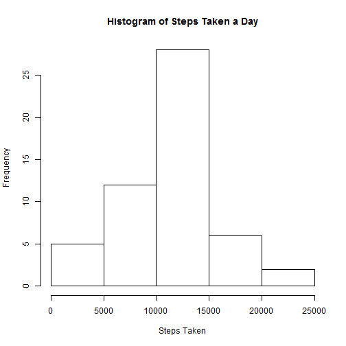
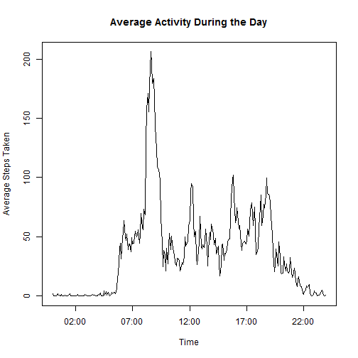
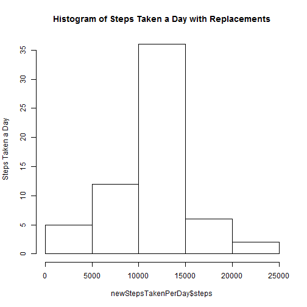
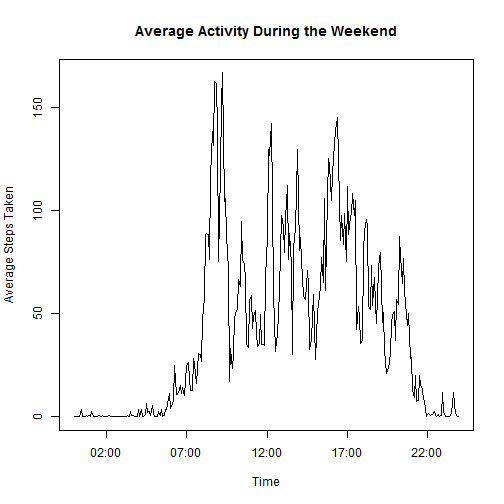
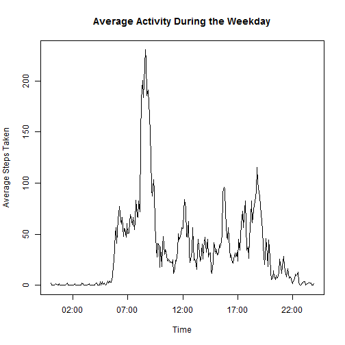

## Loading and preprocessing the data
The required code to load activity.csv into variable "data" is:

```r
data<-read.csv("activity/activity.csv")
```
assuming our working directory is such that "activity/activity.csv" links to the data in question.


## What is mean total number of steps taken per day?
We can first calculate the total number of steps taken per day using the aggregate function as follows:

```r
stepsTakenPerDay<-aggregate(steps~date, data, FUN=sum, na.rm=TRUE)
```
We can now generate a histogram using:

```r
hist(stepsTakenPerDay$steps, xlab="Steps Taken", main="Histogram of Steps Taken a Day")
```

 
We can then calculate the mean and median steps taken per day as: 

```r
mean(stepsTakenPerDay$steps)
```

```
## [1] 10766.19
```

```r
median(stepsTakenPerDay$steps)
```

```
## [1] 10765
```
So mean: 10766.19
Median: 10765
## What is the average daily activity pattern?
We first calculate the average number of steps taken per time interval using the aggregate function as follows:

```r
stepsTakenPerInterval<-aggregate(steps~interval, data, FUN=mean, na.rm=TRUE)
```
We then write a function 

```r
intToHHMM <- function (i) {sprintf("%02d:%02d", i %/% 100, i %% 100)}
```
that returns each interval as a proper time string in HH:MM format. We convert these strings to proper dates using strptime(), and save these values to a newInt variable:

```r
newInt<-strptime(intToHHMM(stepsTakenPerInterval$interval), "%H:%M")
```
Finally, we plot the activity graph using: 

```r
plot(newInt, stepsTakenPerInterval$steps, type="l", xlab="Time", ylab="Average Steps Taken", main="Average Activity During the Day")
```

 

We can then find the max interval of time using

```r
intToHHMM(stepsTakenPerInterval[which.max(stepsTakenPerInterval$steps), "interval"])
```

```
## [1] "08:35"
```

## Imputing missing values
In order to find the total number of rows with NA, w use:

```r
sum(is.na(data$steps))
```

```
## [1] 2304
```
So 2304 missing values.
We now write a function replaceNA that takes all values of our original data set where step-value is NA, and replaces the step-value with the average step-value for the given interval period. This average value will be taken from stepsTakenPerDay.

```r
replaceNA <- function(dataSet, meanValue) {
    for(i in 1:length(dataSet$steps)){
        stepsValue<-dataSet[i, "steps"]
        intervalValue<-dataSet[i, "interval"]
        if(is.na(stepsValue)){
            dataSet[i, "steps"]<-meanValue$steps[which(meanValue$interval==dataSet[i, "interval"])]
        }
    }
    dataSet
}
```
We create a new data-set with these values filled in, and name it newData:

```r
newData<-replaceNA(data, stepsTakenPerInterval)
```
We can now generate a histogram using:

```r
newStepsTakenPerDay<-aggregate(steps~date, newData, FUN=sum, na.rm=TRUE)
hist(newStepsTakenPerDay$steps, ylab="Steps Taken a Day", main="Histogram of Steps Taken a Day with Replacements")
```

 

We can then calculate the mean and median steps taken per day as: 

```r
mean(newStepsTakenPerDay$steps)
```

```
## [1] 10766.19
```

```r
median(newStepsTakenPerDay$steps)
```

```
## [1] 10766.19
```
So mean is 10766.19 compared to 10766.19 from earlier, indicating the replacements had little effect on the mean. This might be expected due to NA values mostly being replaced by averages small in magnitude. The median is also 10766.19 compared to 10765 from earlier. An increase in median is expected since we would expect overall values to increase to account for additional values replacing NA.

## Are there differences in activity patterns between weekdays and weekends?
First we write a function dayDetermine that, when given our data frame, will return a string vector containing "weekend" or "weekday" depending on if the date in a row is a weekday or not:

```r
dayDetermine <- function(dataset){
    weekday <- vector("character", length(dataset$date))
    for(i in 1:length(dataset$date)){
        if(weekdays(as.Date(dataset$date[i]))=="Saturday" ||
                            weekdays(as.Date(dataset$date[i]))=="Sunday"){
            weekday[i]<-"weekend"
        } else{
            weekday[i]<-"weekday"
        }
    }
    weekday  
}
```
we then get the resulting vector, and add it to our existing dataframe newData by creating a new column "Weekend?":

```r
newData["weekend?"]<-dayDetermine(newData)
```
As can be seen from below, the resutling data frame has an additional column with the appropriate values: 

```r
head(newData)
```

```
##       steps       date interval weekend?
## 1 1.7169811 2012-10-01        0  weekday
## 2 0.3396226 2012-10-01        5  weekday
## 3 0.1320755 2012-10-01       10  weekday
## 4 0.1509434 2012-10-01       15  weekday
## 5 0.0754717 2012-10-01       20  weekday
## 6 2.0943396 2012-10-01       25  weekday
```

In order to calculate activity based on whether it is the weekday or not, we extract dataframes of weekday-only and weekend-only:


```r
weekendtrue<-newData$weekend=="weekend"
weekend<-newData[weekendtrue,]
weekday<-newData[!weekendtrue,]
```
We then aggregate data and plot the resulting values:

```r
WeekendStepsPerInterval<-aggregate(steps~interval, weekend, FUN=mean)
WeekdayStepsPerInterval<-aggregate(steps~interval, weekday, FUN=mean)
```

We use intToHHMM again to return each interval as a proper time string in HH:MM format. We convert these strings to proper dates using strptime(), and save these values to a newInt variable:

```r
WeekendnewInt<-strptime(intToHHMM(WeekendStepsPerInterval$interval), "%H:%M")
WeekdaynewInt<-strptime(intToHHMM(WeekdayStepsPerInterval$interval), "%H:%M")
```
Finally, we plot the activity graph using: 

```r
par(mfro=c(2, 1))
```

```
## Warning in par(mfro = c(2, 1)): "mfro" is not a graphical parameter
```

```r
plot(WeekendnewInt, WeekendStepsPerInterval$steps, type="l", xlab="Time", ylab="Average Steps Taken", main="Average Activity During the Weekend")
```

 

```r
plot(WeekdaynewInt, WeekdayStepsPerInterval$steps, type="l", xlab="Time", ylab="Average Steps Taken", main="Average Activity During the Weekday")
```

 


