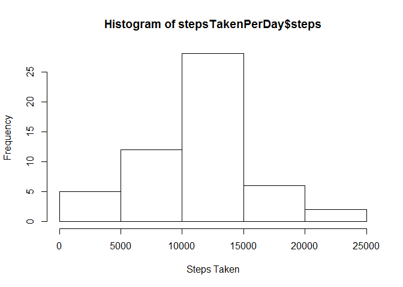
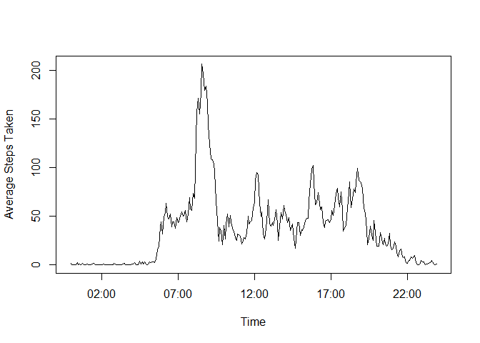

# Reproducible Research: Peer Assessment 1


## Loading and preprocessing the data
The required code to load activity.csv into variable "data" is:

```r
data<-read.csv("activity/activity.csv")
```
assuming our working directory is such that "activity/activity.csv" links to the data in question.


## What is mean total number of steps taken per day?
We can first calculate the total number of steps taken per day using the aggregate function as follows:

```r
stepsTakenPerDay<-aggregate(steps~date, data, FUN=sum, na.rm=TRUE)
```
We can now generate a histogram using:

```r
hist(stepsTakenPerDay$steps)
```

 
We can then calculate the mean and median steps taken per day as: 

```r
mean(stepsTakenPerDay$steps)
```

```
## [1] 10766.19
```

```r
median(stepsTakenPerDay$steps)
```

```
## [1] 10765
```
## What is the average daily activity pattern?
We first calculate the average number of steps taken per time interval using the aggregate function as follows:

```r
stepsTakenPerInterval<-aggregate(steps~interval, data, FUN=mean, na.rm=TRUE)
```
We then write a function 

```r
intToHHMM <- function (i) {sprintf("%02d:%02d", i %/% 100, i %% 100)}
```
that returns each interval as a proper time string in HH:MM format. We convert these strings to proper dates using strptime(), and save these values to a newInt variable:

```r
newInt<-strptime(intToHHMM(stepsTakenPerInterval$interval), "%H:%M")
```
Finally, we plot the activity graph using: 

```r
plot(newInt, stepsTakenPerInterval$steps, type="l")
```

 

We can then find the max interval of time using

```r
intToHHMM(stepsTakenPerInterval[which.max(stepsTakenPerInterval$steps), "interval"])
```

```
## [1] "08:35"
```

## Imputing missing values
In order to find the total number of rows with NA, we use:

```r
sum(is.na(data$steps))
```

```
## [1] 2304
```


## Are there differences in activity patterns between weekdays and weekends?
