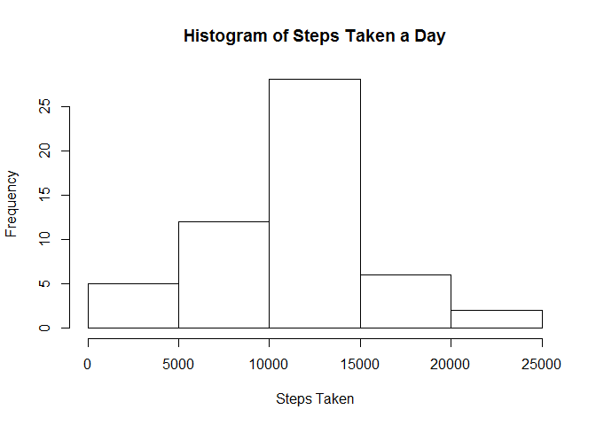

# Reproducible Research: Peer Assessment 1


## Loading and preprocessing the data
The required code to load activity.csv into variable "data" is:

```r
data<-read.csv("activity/activity.csv")
```
assuming our working directory is such that "activity/activity.csv" links to the data in question.


## What is mean total number of steps taken per day?
We can first calculate the total number of steps taken per day using the aggregate function as follows:

```r
stepsTakenPerDay<-aggregate(steps~date, data, FUN=sum, na.rm=TRUE)
```
We can now generate a histogram using:

```r
hist(stepsTakenPerDay$steps)
```

 
We can then calculate the mean and median steps taken per day as: 

```r
mean(stepsTakenPerDay$steps)
```

```
## [1] 10766.19
```

```r
median(stepsTakenPerDay$steps)
```

```
## [1] 10765
```
## What is the average daily activity pattern?


## Imputing missing values


## Are there differences in activity patterns between weekdays and weekends?
