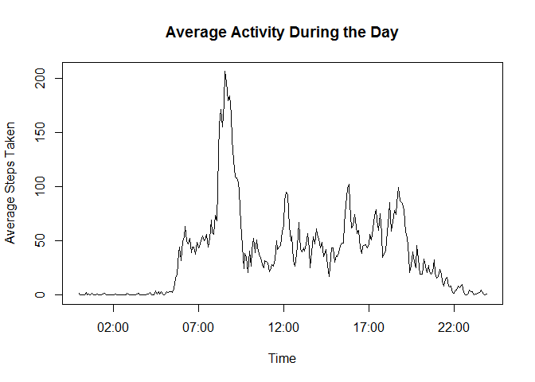

# Reproducible Research: Peer Assessment 1


## Loading and preprocessing the data
The required code to load activity.csv into variable "data" is:

```r
data<-read.csv("activity/activity.csv")
```
assuming our working directory is such that "activity/activity.csv" links to the data in question.


## What is mean total number of steps taken per day?
We can first calculate the total number of steps taken per day using the aggregate function as follows:

```r
stepsTakenPerDay<-aggregate(steps~date, data, FUN=sum, na.rm=TRUE)
```
We can now generate a histogram using:

```r
hist(stepsTakenPerDay$steps, xlab="Steps Taken")
```

 
We can then calculate the mean and median steps taken per day as: 

```r
mean(stepsTakenPerDay$steps)
```

```
## [1] 10766.19
```

```r
median(stepsTakenPerDay$steps)
```

```
## [1] 10765
```
So mean: 10766.19
Median: 10765
## What is the average daily activity pattern?
We first calculate the average number of steps taken per time interval using the aggregate function as follows:

```r
stepsTakenPerInterval<-aggregate(steps~interval, data, FUN=mean, na.rm=TRUE)
```
We then write a function 

```r
intToHHMM <- function (i) {sprintf("%02d:%02d", i %/% 100, i %% 100)}
```
that returns each interval as a proper time string in HH:MM format. We convert these strings to proper dates using strptime(), and save these values to a newInt variable:

```r
newInt<-strptime(intToHHMM(stepsTakenPerInterval$interval), "%H:%M")
```
Finally, we plot the activity graph using: 

```r
plot(newInt, stepsTakenPerInterval$steps, type="l", xlab="Time", ylab="Average Steps Taken")
```

 

We can then find the max interval of time using

```r
intToHHMM(stepsTakenPerInterval[which.max(stepsTakenPerInterval$steps), "interval"])
```

```
## [1] "08:35"
```

## Imputing missing values
In order to find the total number of rows with NA, w use:

```r
sum(is.na(data$steps))
```

```
## [1] 2304
```
So 2304 missing values.
We now write a function replaceNA that takes all values of our original data set where step-value is NA, and replaces the step-value with the average step-value for the given interval period. This average value will be taken from stepsTakenPerDay.

```r
replaceNA <- function(dataSet, meanValue) {
    for(i in 1:length(dataSet$steps)){
        stepsValue<-dataSet[i, "steps"]
        intervalValue<-dataSet[i, "interval"]
        if(is.na(stepsValue)){
            dataSet[i, "steps"]<-meanValue$steps[which(meanValue$interval==dataSet[i, "interval"])]
        }
    }
    dataSet
}
```
We create a new data-set with these values filled in, and name it newData:

```r
newData<-replaceNA(data, stepsTakenPerInterval)
```
We can now generate a histogram using:

```r
newStepsTakenPerDay<-aggregate(steps~date, newData, FUN=sum, na.rm=TRUE)
hist(newStepsTakenPerDay$steps)
```

 

We can then calculate the mean and median steps taken per day as: 

```r
mean(newStepsTakenPerDay$steps)
```

```
## [1] 10766.19
```

```r
median(newStepsTakenPerDay$steps)
```

```
## [1] 10766.19
```
So mean is 37.3826 compared to 10766.19 from earlier, and 
median is 0 compared to 10765 from earlier
## Are there differences in activity patterns between weekdays and weekends?
